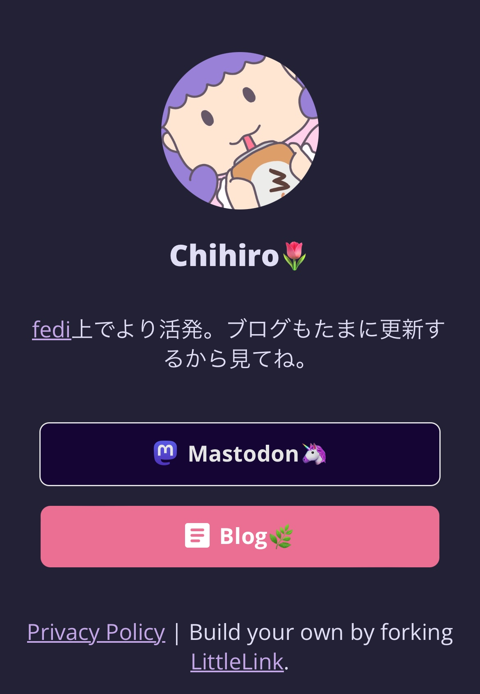

+++
title = "Linktreeみたいなやつ"
date = "2024-09-04"
tags = [
    "selfhosted",
    "foss"
]
+++

Linktreeって有名な人も使っててオシャレじゃん。それにインターネット上の名刺みたいで自分もひとつほしい。

でもLinktreeで色変えようとしたら有料になる。それなら、自分の計算資源余ってるし自分のドメイン使えるからセルフホストしようと思ったというわけ。

どんなのがあるかなーと調べた結果、LittleLinkから枝分かれしたLinkStackというのがイケてるという事が分かった。これは自分で設定ファイルをゴリゴリ書かなくてもダッシュボードでボタンポチポチで設定できてカッコいいテーマも揃ってて人気らしい。ファイルをそのまま展開する方法もあったけど、Dockerバージョンがあったんでそれを使った。

とても豪華なUIで、複数のユーザーがアカウントを作って使えるようにもなってた。もちろん登録を閉じることもできる。

Mastodonの専用の設定も既にあったよ。しかも勝手にrel=meまでつけてくれるようになってた。

直感的な操作で楽しいので色々設定してたら、何故か他の動いてたコンテナを全て巻き込んで落ちるという事態が何度か発生し、よく分からんので他のやつを試すことにした。

LinkStackの枝分かれ元のLittleLinkというやつがシンプルで良さそうだったので今度はこれを設定した。

リッチな編集画面は無いけどそこそこ飾り付けできるし良かった。今思ったけど、自分そんなに公開するリンクなかった。

おわり

