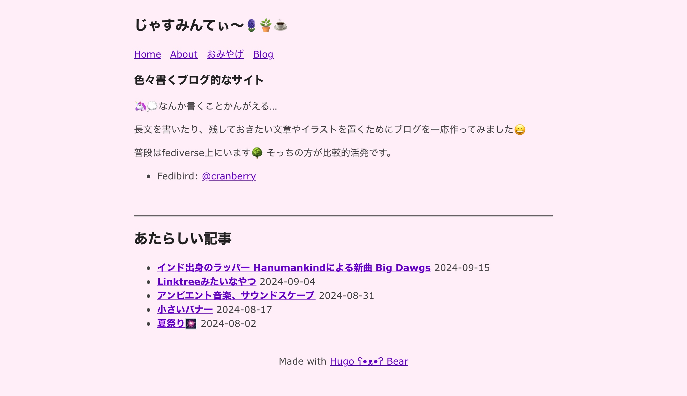

+++
title = "HugoのBear Blogテーマのホームページに新着記事を表示する"
date = "2024-09-22"
tags = [
    "hugo"
]
+++

[Hugo ʕ•ᴥ•ʔ Bear Blog](https://github.com/janraasch/hugo-bearblog)

このテーマだと、ブログ記事にたどり着くためには上にある”Blog”ボタンを押してブログ一覧ページに行ってから選ぶという手順になる。これだとちょっと奥に隠れている感じがする。

だから、ホームページの下半分の辺りに直近のブログ記事へのリンクが数個表示できたら便利だと思った。

色々調べた🔍結果、以下の方法で思ったような表示ができるようになった。あんまりこういうの詳しくないけど、もし同じテーマを使って同じことがしたい人がいた時のために書いて残しとく📝

この👉[Hugoで最近更新された記事（新着記事）のリストを表示する|まくまく Hugo ノート](https://maku77.github.io/p/pocxi4n/)サイトを参考にしたよ。🙏🙏

まず、themes/hugo-bearblog/layouts/index.htmlをコピーしてlayoutsフォルダに貼り付ける。

次に、新しくlayouts/partials/recent.htmlを作って下の内容を書き込む。(別に名前は何でもいい)
```
<h2>あたらしい記事</h2>
<ul>
  {{ range first 5 .Site.RegularPages.ByDate.Reverse }}
    <li>
      <b><a href=“{{.RelPermalink}}”>{{.Title}}</a></b>
      <time>{{.Date.Format “2006-01-02”}}</time>
    </li>
  {{ end }}
</ul>
```
↑ 3行目の first 5 のところの数字を変えると表示される件数が変わるよ

最初にコピーしてきたindex.htmlを開く。すると最初はこうなってるんで、

```
{{ define “main” }}
{{ .Content }}
{{ end }}
下から2行目に追記する

{{ define “main” }}
{{ .Content }}
{{ partial “recent.html” . }}
{{ end }}
```
これでホームページの後半に新着記事が表示されるようになったはず！🙌 

