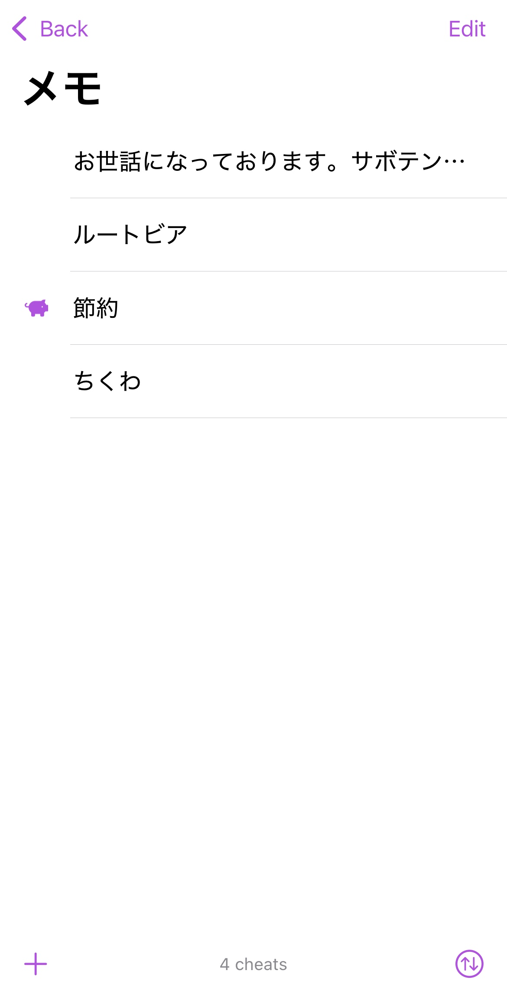

+++
title = "おすすめアプリ紹介 Cheatsheet(iOS)"
date = "2024-09-25"
tags = [
    "app"
]
+++

昔からよく使うお気に入りのメモアプリが今もメンテナンスされ続けて、iOS18のサポートも始めたということで感動して記事を書こうと思った。  

たぶん買ったのは5年くらい前で、アプリは2014年頃から存在してるらしい。次の10年もメンテナンスされ続けてほしいな🙏

自分が使ってるメモアプリは何個かあるけど、これはちょっとしたメモとかホーム画面に貼り付けてフセン的な使い方をしたいときに使うかな。

もちろん無料でも基本的な機能は使えるけれど、iCloud同期機能とかを使おうとしたらPro版が必要になる。今は900円らしいよ。それから、ありがとうの気持ちを伝えるチップ箱もあるから、課金癖がある人は(もちろん普通の人も)どんどんチップを課金して開発者の人を潤わせていこう。💪💴 

アプリを起動してすぐの画面はこんな感じ。  

フォルダを開くとメモはこういう風に表示される。 

メモを作った順に並び替えることもできるし、自分で自由に配置することもできる。

このアプリはウィジェット機能も充実してる。サイズも大中小とあるよ。よく使うのはふつうウィジェットとアクションウィジェットだね。

ふつうウィジェットはふつうにメモが表示される。  そんで、どのフォルダのメモを表示するかとか色とか文章を折り返し表示するかとか色々設定できる。初期設定は直近のメモを表示するになってるよ。 

アクションウィジェットはメモに対して、タップしたらそのメモをコピーするとかリンクを開くとかができるやつ。  ☝️これはタップしたらコピーできるように設定したアクションウィジェット。定型文とか、よく使う文章やタグをコピペして使うのに便利じゃないかな。

Appleのショートカットアプリから使えるコマンドも多く揃ってるから、なんか自動化したいときにいいね

ここで紹介した以外にも設定項目が色々とあるから、iPhoneとかiPadを持っている人はぜひアプリをダウンロードして試してみてね😀🌸

**追記**: これから新しく始める人はサブスクリプションを要求されるようになったよ。過去に購入したことがある人は影響を受けないよ。