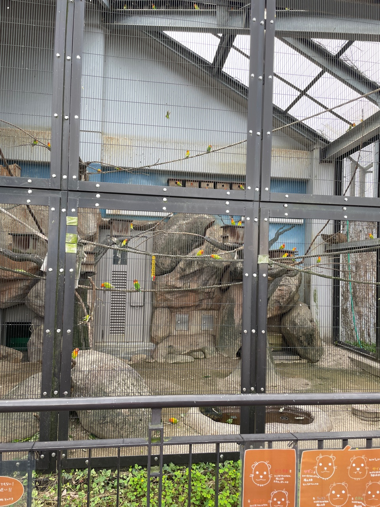
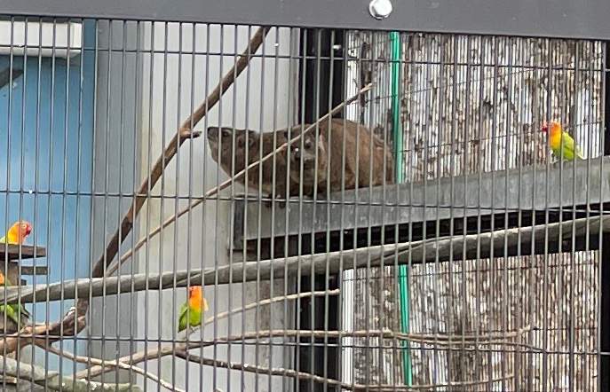
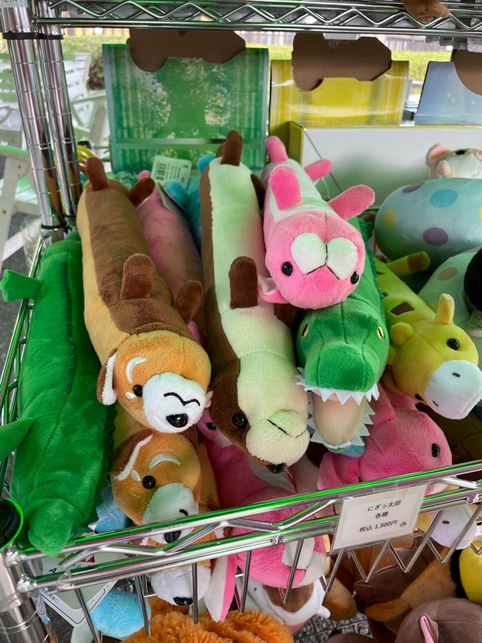
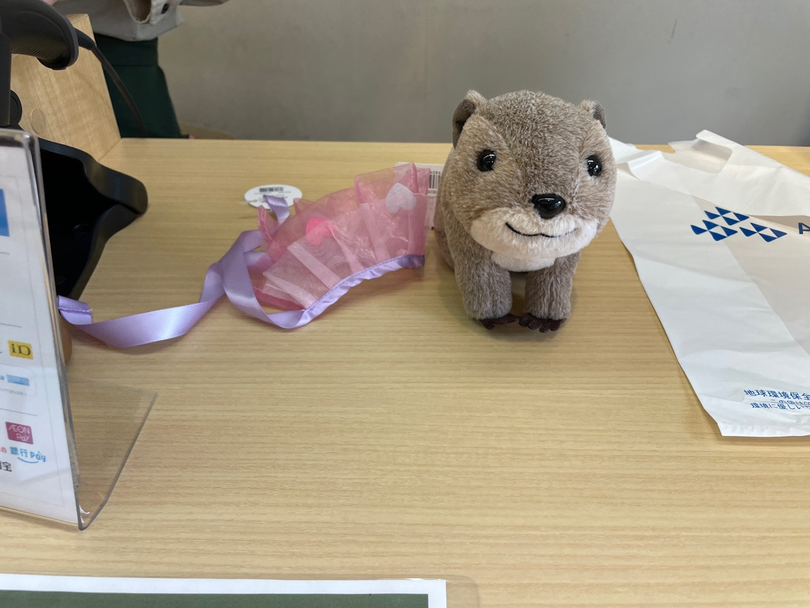
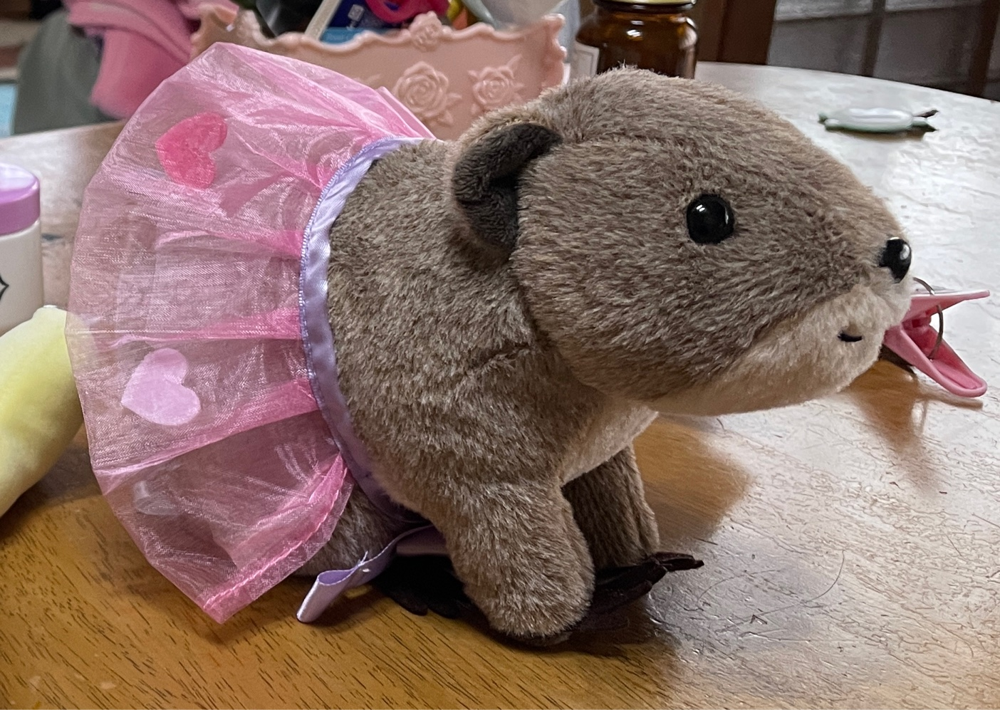
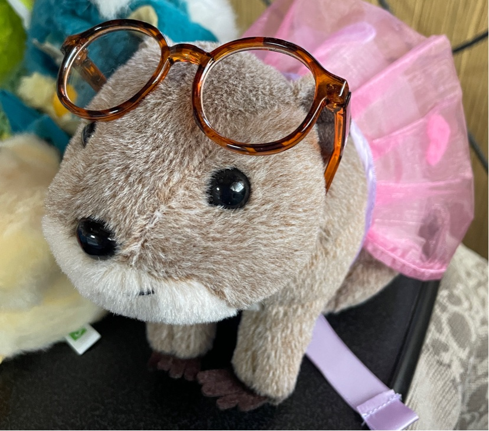
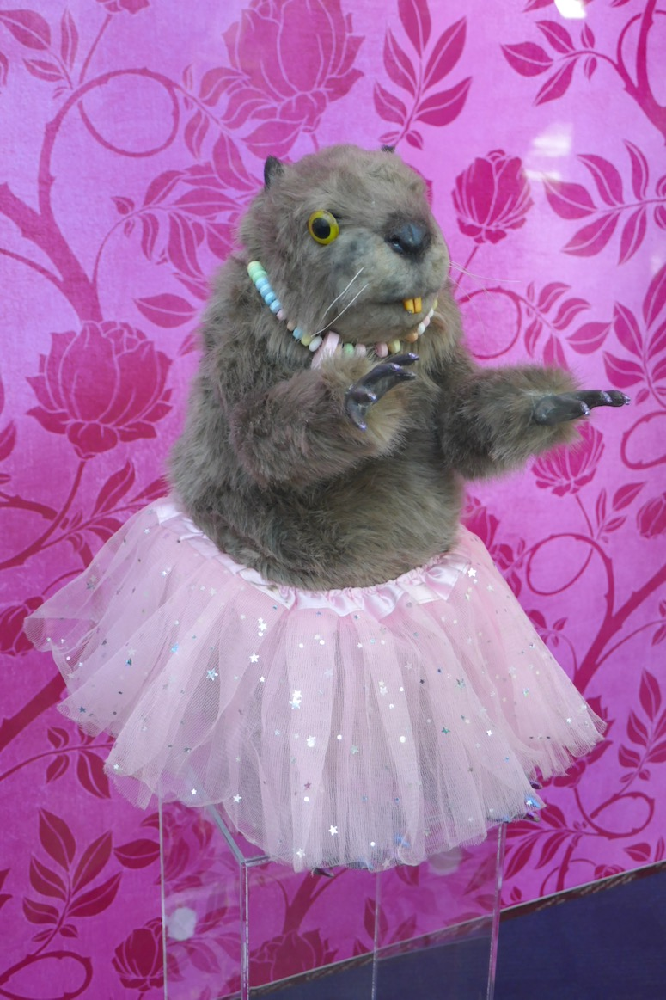

+++
title = "今年買ったもの: ケープハイラックス、のぬいぐるみ"
date = "2024-12-08"
tags = [
    "日記"
]
+++

[りんごぱい Advent Calendar 2024](https://adventar.org/calendars/10045) 向けに書いた記事です。りんごぱいかわいい🍎🙏

数ヶ月前に動物園に行った。カラフルなインコがいる檻があるな、と思って近づいてよく見ると種類が全然違う同居人達がいた。一見カピパラかなんかに見えるこの動物の名前はケープハイラックス。檻に3,4匹いた。  よく見てください

 
 *こいつらです*

ケープハイラックスがどてどてっとちょっと走ると、インコたちがバーっと一斉に逃げていく。落ち着いたかと思ったら、また別のケープハイラックスがゴソゴソっと動く。またインコがバサバサっと別の方向に避ける。

暮らしにくくないのかなと思ったが、野生ではこういう環境で生活してるから大丈夫らしい。

動物園のおみやげ屋さんはいろんなぬいぐるみを売ってるから、どこのに行っても必ず覗く。ここにもいろんなのがいっぱい！！

細長いのとか。

*けっこうする*

お店の中に入ったらイオンのかわいい服屋さんみたいに奥から店員のお姉さんが出てきて、それぞれのぬいぐるみの説明をしてくれた。店内に目立つようにしてディスプレイされていたケープハイラックスを見ると、そんなに気になっていなかったのに俄然凄くほしくなってきた！！

一緒に売ってた服と一緒に買った。

家に連れて帰ってしばらくおいていると、なんか見覚えがあるなぁと思った。

Birds of Prayのハーレイクインの部屋にいたあいつだ！！すっきり！ 

