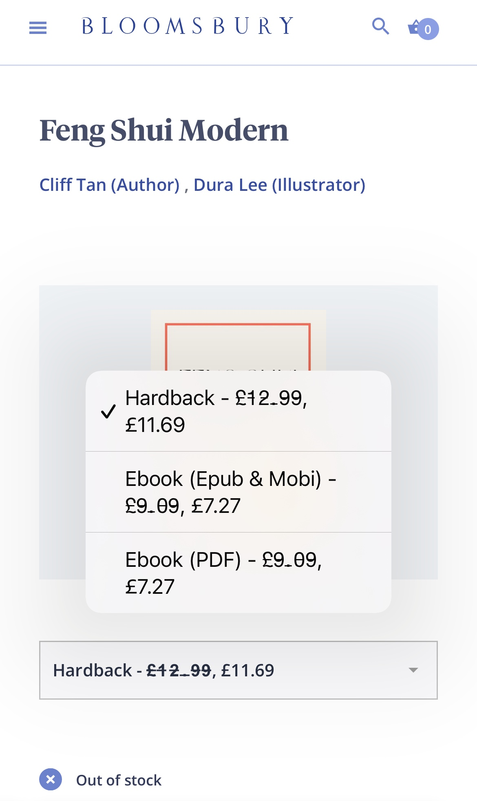
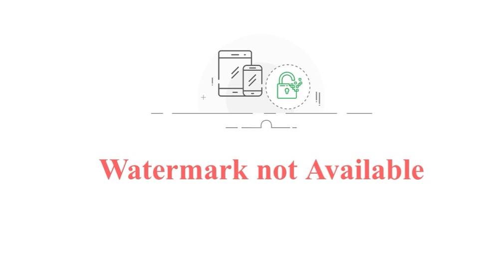
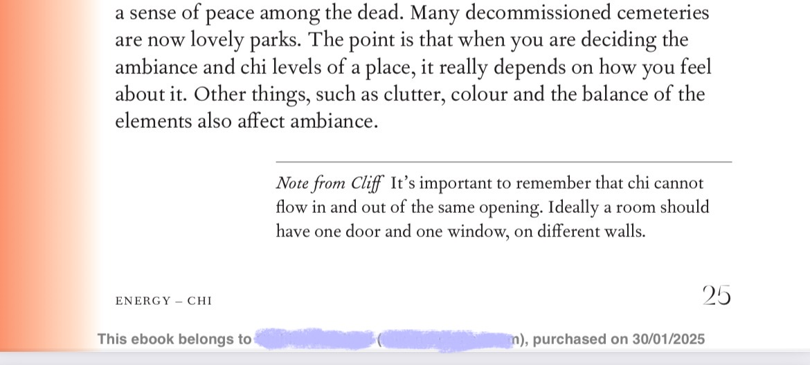

+++
title = "出版社から直接電子書籍を買う"
date = "2025-02-02"
tags = [
    "本"
]
+++

風水をお部屋の家具の配置とかに活かすCliff Tanって人がいて、その人の[ショート動画](https://youtube.com/shorts/xapiNz0D06Q?si=XsjfOZOiuLJ1YBTD)がおもしろい。

彼についての話はまた今度するとして、その人が本を出してたんで是非買ってみようと思った。（電子書籍）

まず日本のAmazonで探したら¥2707！ アメリカAmazonでは$9.99。一応出版社のショップを見てみると…£7.27💡

しかも、epub版とpdf版が選べる。それぞれに値段ついてるけど。この本は紙面のデザインがおしゃれだからpdf版を買った。ここで買うとKindleの本みたいにDRMがつかない。しかしその代わりに購入した人の名前とメールアドレスが埋め込まれるそう。そういうやり方も良いと思う。で、早速本をダウンロードしようとすると…

こういうエラー🤨

しばらく待って試してみたけど同じ。仕方ないのでサポートにメール✉️を送った。2日後くらいにお返事が来て、そこにあるリンクから行くと無事本がダウンロードできた！よかった、よかった。

どういう風に名前が入ってるのかな…と思いながらpdfを開くと、コレ！👇

 でっか！！！！ これは海賊行為に対する抑止力になるわ。 毎ページにこれがついてる😅

色んなアプリや端末で読めてバックアップが取れるし書き込みもできるのとトレードオフだね。

これはepubの場合も似たような感じで埋め込まれるんかな？読んでる時に結構気になるで笑笑

でもDRMなしで売ってくれるのは良い方向性だね！選択肢が多いのは良いことだよ🙆

日本では技術書やインディーズの本はDRMなしで売ってるのを見たことあるけど、一般的な本ではまだ見たことないかな。また電子書籍界隈が盛り上がったらうれしいな〜

ところで、昔売ってたSonyのReaderがかっこいいので中古で買おうかと迷ってます…