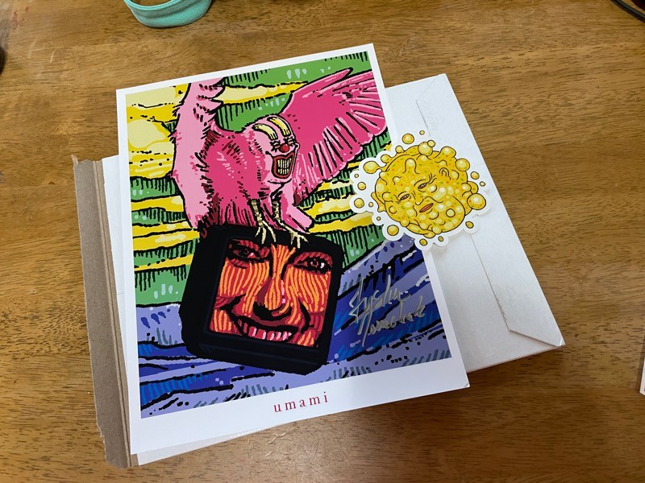

+++
title = "カナダからの郵便物✉️"
date = "2025-02-24"
tags = [
    "diary"
]
+++

主にYouTubeで活動しているカナダのアーティストのumamiが大好き！ 独特なスタイルのアニメーション作品を作ってるんだよ。それから、Hexsystem名義で音楽も作ってるんだけれど、こちらも最高😀 えもい。

代表的な作品としてInterfaceシリーズとSafe Modeシリーズがあるよ。最近、新しいSafe Modeのエピソードが追加されて感動しながら鑑賞した🥹

去年の1月くらい、新しい仕事を始めてすぐくらいに見つけた。夜中に布団の中でVHSエフェクトがかかった方のInterfaceを見た時間はまるで明晰夢でも見ているかのような感じだった☁️🛌

そんなこんなで、ここしばらくPatreonへ入って中くらいの寄付をしてる。その特典の一つであるサイン入りアートプリントが今日郵便受けに入ってた！

スープのアイツのステッカーも付いてる。やったーーー！！

みんなもumamiの作品見てみてね。オススメ⭕️

いつか字幕を翻訳しようかと試みたこともあるけど、自分の翻訳センスの無さを感じた。意味を全部入れようとしてクソ長くなったり、日本語としておかしくなったり…難しいね…