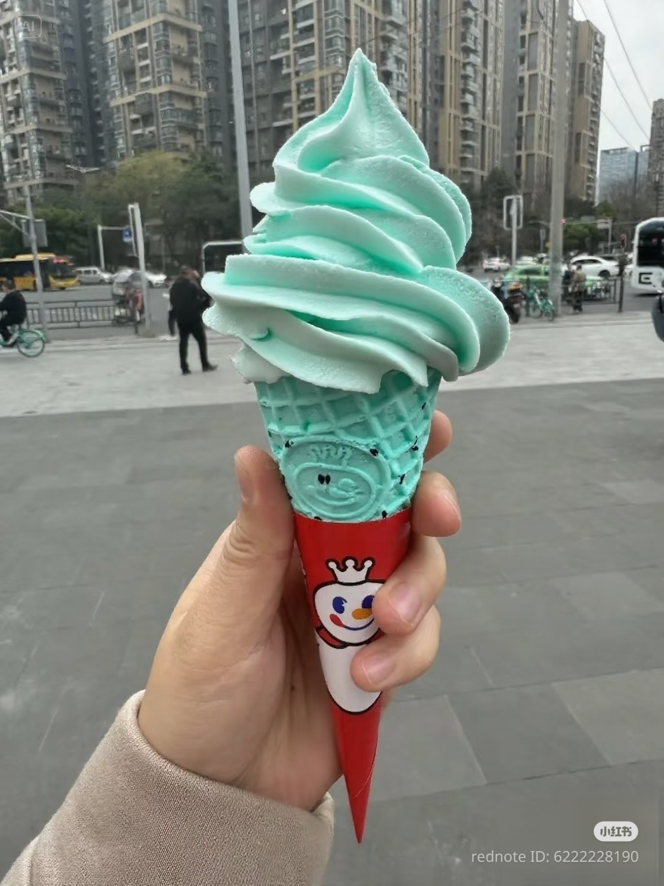
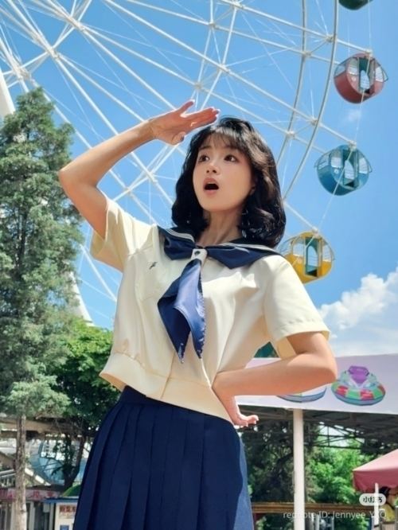
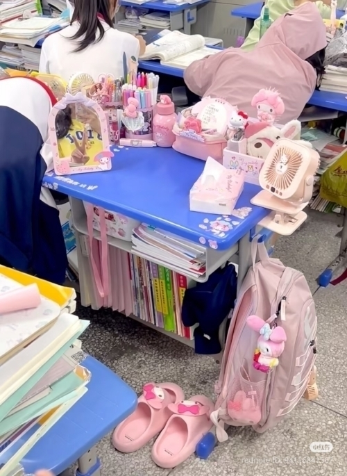
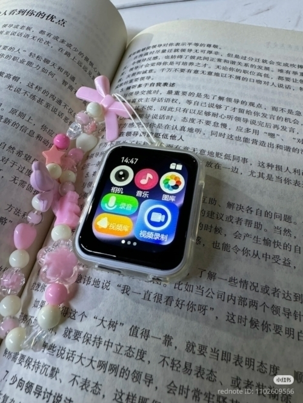

+++
title = "未開の地、小紅書📕"
date = "2025-07-27"
tags = [
    "diary"
]
+++

最近、中国のインスタ的立ち位置の小紅書ってアプリを探検してる。

軽く閲覧するだけならアカウントいらないし、Googleアカウントとか使ってログインもできる。プロフィールを細かく設定しようとしたり、投稿しようとしたら電話番号の登録を求められる。日本の電話番号でもok。

アプリの使用言語を英語にしてると全部自動翻訳してくれるから、中国語全然分からなくても大丈夫。逆に日本語にしてるとUIぐらいしか翻訳ないっぽい。要検証

小紅書の主なユーザーは若い女子っぽい。全体的な投稿の傾向がヤングな女子感があるから。そりゃおっさんもおると思うけど。

↑MIXUEのソフトクリーム。中国にはいろんな飲み物チェーン店があるけど、MIXUEはかなり低価格な方ね。雪だるまのマスコットがウザかわいい。日本にも出店しとるらしいで。でも、もっと学生が多いような場所に出店した方がいいと思う…

↑やっぱ昭和の波が来とるね。昭和のアイドルっぽくお化粧したりヘアスタイルをまねたり、楽しそう。上手いし。

モデレーションが行き届いているというのもあるけど投稿もコメント欄も平和な雰囲気。（トピックによる）

あ、プロフィールに接続ipから判断された国の名前が表示される💧

とりあえず最初の投稿を「始めました〜🌻」みたいな感じでしたら、めっちゃ友達になってください的なDMとかコメントきた。藁🗿

オモロそうだったんで、最初の何人かとDMで会話してみた。

結構ぐいぐいくるんでペースもってかれがちだったが、総じて日本人の女子に興味があるらしい。あんたホンマに日本人か？？？みたいにめっちゃ確認された(最近食べたアイスのゴミとかお菓子の箱とかで証明した😅)。なんか、日本人女子になりすます中国女子がわりとおるらしい。オシャレだからなのかな…？

日本の女子のことはここではsakura girlというらしい。じゃあ中国女子は何ガール🌷🌼🌹と呼べばいいのかと思ったが、別に花の名前をつけるのではなく、パンダ🐼ガールというんだって。それはそれでかわいいけど。

日本の制服風のjkスタイル服が流行ってて、大きいお姉さんなんかもわりと楽しんで着てることある。それから、たまたまかもしれないがカードキャプターさくら関連の投稿がよく目に入る気がする。コスプレしてアニメのシーンの再現してたり、楽しそう。

レトロなaestheticを感じるために、かわいい昔の電子機器というか電子ゴミをシールでデコってちょっと使う流れもある。バルミューダフォンが出てきたときは驚いた。どこから入手してきたんや

近いのになんだか遠く感じる中国。でもここには色んな投稿に混じって中国女子のリアルも垣間見える。

例えば、学校のクラスの机の上は家の勉強机か！いうくらいの教科書や書類や文房具や扇風機やらが置いてあってまるで自分の城で楽しそう。と同時に勉強量やべーな、とか制服は体操服みたいでダサいけど本人達はこれはこれで守られてる感があって安心して過ごせるらしいとか、学校にスマホの持ち込みが禁止されてるから(または親が金くれなくて買えないから)、mp3・mp4と呼ばれるウォークマンみたいな小さいデバイスを持ってきて音楽を聴いたり電子書籍(txt形式や)を読んだりビデオを見たりして息抜きしてるとか、そういうのが分かっておもしろい。

それから、四輪とか三輪の超簡易的な電気自動車を魔改造してかわいい部屋みたいにしとる女子とか。あれ免許なしで乗れるらしいで…

グローバル版だけかわからないけど今のところ広告ない。

でもアプリ内での明らかな宣伝行為とかはなんか規制されとるぽいので、ぼかした表現にしてたり「これ、どこで売ってるんですか？？」的なコメントに「DMしてね！」とかURLをスクショして上下ひっくり返した画像を貼ってたりする。

というわけでとりあえず冒険してきた軽い報告。また記事書くね😀

わたしのアカウント👇️ [https://www.xiaohongshu.com/user/profile/68733a3f000000001d0096c7](https://www.xiaohongshu.com/user/profile/68733a3f000000001d0096c7)