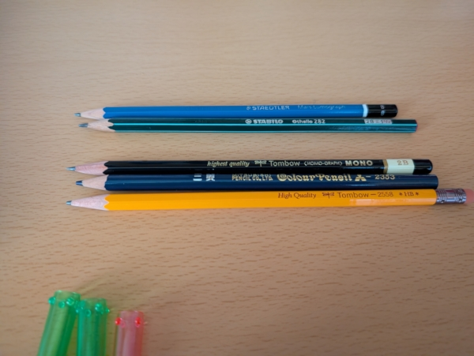
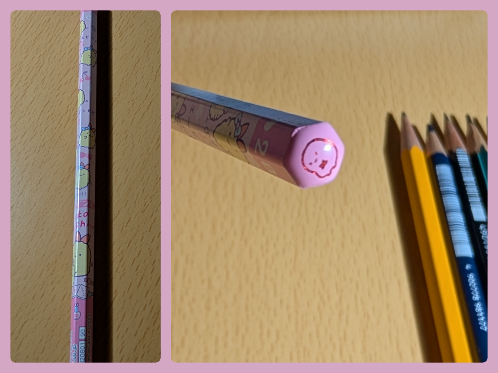

+++
title = "えんぴつ再発見"
date = "2025-10-19"
tags = [
    "文房具"
]
+++

学校を卒業してから文房具を使う機会がなくなり、好きだけど買ってもしょうがないから遠ざかってたんだけど、数年前に語学をやり始めたときに、文房具を使う機会が超増えてそれを良い口実に色々と買って使った。

いっぱい字を書くけど手を疲れさせたくない、ということで一時は万年筆に凝ってた。高くても1万円くらいのまでしか買わなかったけど、結局よく使うのは安い子ども用のペン(に青い顔料インク入れたやつ)… 道具らしさが好きなのかもしれない。

ボールペンもほんまに色んな種類を買って試してたから、ボールペンソムリエになれるかもしれん。好きなのはエナージェルの青の0.7とBICの青の1.0かな。ちょっと高級なペンの軸に切り刻んだ日本のリフィルをねじこんだり‥なつかしい。

そんで、最近は一昔前ほど書きものをすることがなくなったんで、まぁ適当なボールペンを机の上に転がしてた。メモパッドか自由帳が広げてあってすぐにメモが取れるようにしてんだけど、ペンはノックしたりフタ開けたりするひと手間がいるなぁと思いだし、かといってフタ開けたままにして置いとくと転がるしちょっと他のものに汚れつくかもしれんしで、考えてたら思いついた。

**えんぴつ**あるじゃん…

↑*えんぴつコレクション*

なんか、えんぴつには小学校のイメージとか、黒しかないし手汚れるし芯がすり減って字の太さ変わるしみたいなダサいイメージがあったんだけど、改めて使うと道具としての良い面にも気づいた。

- 垂直面にでも書ける
- 軽い
- ほったらかしててもすぐに書ける
- 筆圧で濃さの調整がしやすい
- 書いた後にすぐ蛍光ペンを使ってもほぼにじまない・汚れない

自分は消しゴムいらん派で、鉛筆に消せるかどうかを求めていないので、青い色鉛筆を筆記用に使ってたりもする。これはこれでかわいいしオシャレ。おすすめ。色鉛筆で普通に字書くの。芯が太いし柔らかいからすぐちびるけど。

それから、昨日規模の小さいジャスコみたいなとこに行ったときに女児向け雑貨コーナーで小学生の隣で5分くらいウンコ座りしてとっておきの1本を選んできた。

じゃーん。すみっこぐらし六角えんぴつ(2B)✨

おしり部分にはタピオカ。

えんぴつは毎日使ったからといってそんなに減るもんではないので、これ以上新しく買うのは辛抱する。

というわけで、えんぴつの良さ、再発見しました。みんなもあえて使ってみてね👋