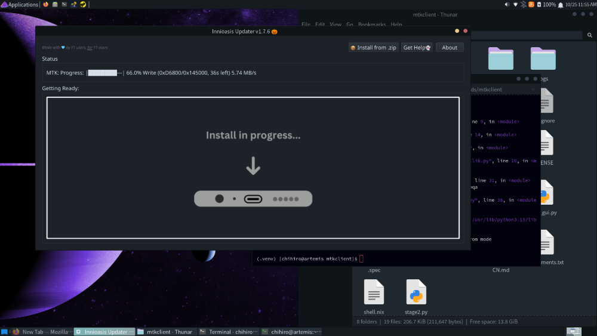
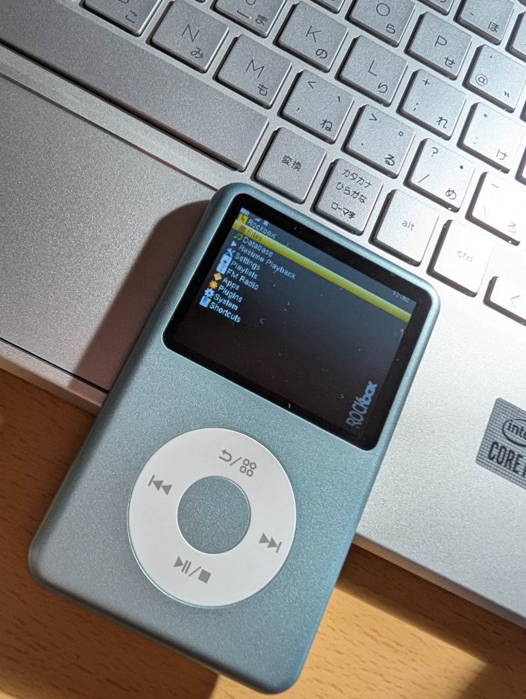
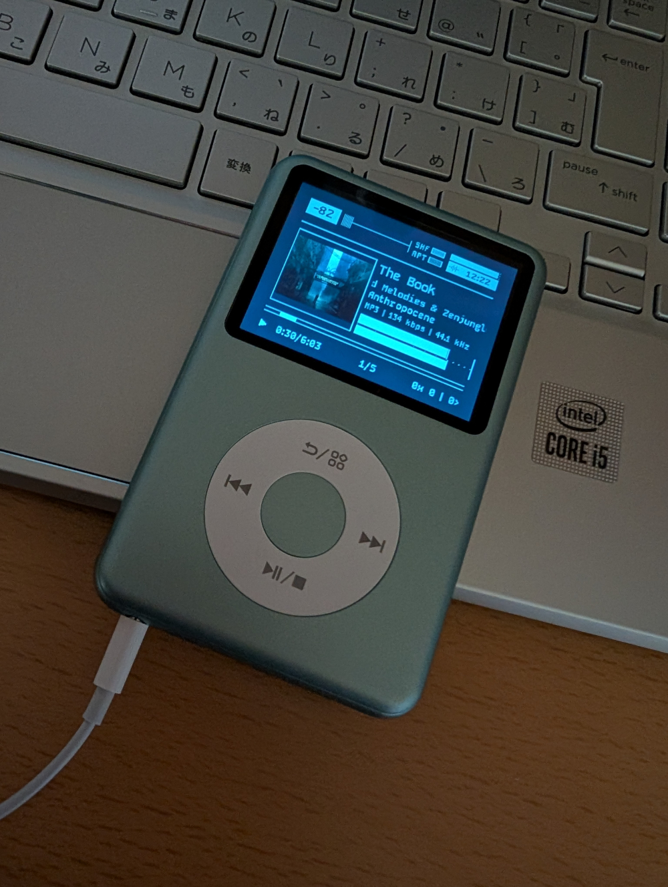

+++
title = "iPodもどき、Rockboxインストール"
date = "2025-10-25"
tags = [
    "dap",
    "tech"
]
+++

[r/DigitalAudioPlayer](https://www.reddit.com/r/DigitalAudioPlayer/)をうろついてたら、流行ってるdapがいくつかあって、その中でもiPodぽいInnioasis Y1とやらがかわいい見た目とぐるぐるホイールを持ってたのでアリエクスプレスで１個注文した。

１週間くらいで届いた。とりあえずはそのまま使ってみたんだけど、再生中画面に表示されるタイトルがなぜかファイル名だったり(他のアルバム名とかはタグからちゃんと拾えてるのに‥謎)、良いっちゃ良いけど気になるところがあったんで、おなじみのRockboxが使えるそうなのでそれをインストールしたよ。

有志が作ってくれたツールがあるので、ここ[https://innioasis.app/](https://innioasis.app/)の"Innioasis Updater"から自分のOSを選んで後は指示どおりに進めればok。

…Linux以外は🗿

Linuxの人は"Linux🐧"ボタンを押しますと、こちらのgithubリポジトリに案内されます。[y1-community/Innioasis-Updater](https://github.com/y1-community/Innioasis-Updater)

まあなんか色々書いてるけど、このリポジトリを自分のPCのどっかにクローンします。

そんで次は、ここ[bkerler/mtkclient](https://github.com/bkerler/mtkclient)へ行って説明を読んで要るパッケージをインストールします。

その次も説明を読んでリポジトリをクローンし、指示されたコマンドを入力します。

これはその人の環境によると思うけど、自分はvenvを使うやり方じゃないとできんかった。

その後は、指示されたユーザーグループにユーザーを追加するけど、そもそもそのユーザーグループが無かったら作ります。

"Install rules"までが終わったら再起動しときます。

自分はここで引っかかってたんだけど、これからglibcの2.42が要ります。今あるのがちょっと古いやつ。丁度いいから全体的にpacman -Syuしようとしたら、なんかいっぱい依存関係のエラーが出てきて今解決するのだるかったから、glibcだけアップデートしようとしたらまた別の依存関係エラーが出て調べたら、glibcとglibc32は同時にアップデートせんといけんらしい。解決。⌛(⇐貴重な休日に失われた時間)

ここまでしたら、最初にクローンしてきたInnioasis Updaterのディレクトリに移動して、(venv内で)updater.pyを実行しますと、すてきなGUI画面が出てくるのでもうここまで来たら画面の言うとおりにボタンを押したりケーブルを抜いたり差したり待ったりしたらok。

終わったら、Y1の真ん中のボタンを押してしばらく待つと、Rockboxが起動します。やったね。

そのままじゃ味気ないので、テーマを探してきて.rockboxディレクトリに入れます。このromはiPodのテーマと互換性のある240pバージョンなのでテーマの選びしろがいっぱいある。

じゃーーん。lofiな見た目でかわいいね！

しばらくはこれで遊びます。自分が買ったときは6,000円くらいだったよ。色も5種類くらいあったから、みんなにもオススメ。

細かいことが気にならない人は元々の状態でも普通に使えるから大丈夫🙌