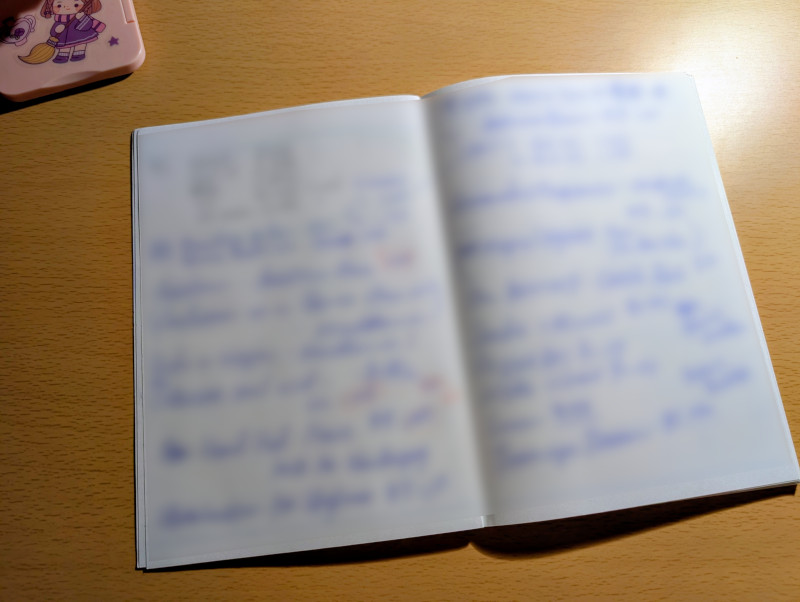
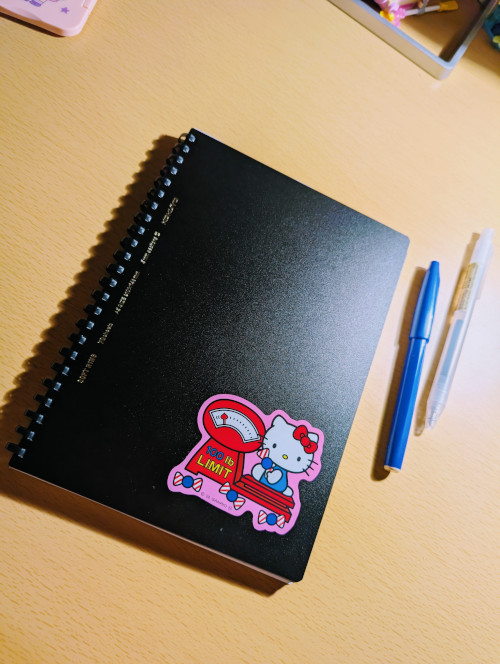

+++
title = "Commonplace Book"
date = "2026-05-02"
tags = [
    "productivity",
    "文房具"
]
+++

メモ帳としてObsidianも使うけど、紙のノートも使う。
紙のノートのメモはどちらかというともっと一時的な内容だったり、図が多くてそこらへんの紙に手で書いた方が早いような内容に使う。

👇(内容しょーもなさすぎてぼかした)

巷ではCommonplace Bookとかいうノート術が流行っとるらしい。

↑こんなん

なんか色々あるけど、自分はメモの内容ごとにノートを分けず、一冊のノートに書いて行くというアイデアだけを採用してる💡

今までは自由帳とかコンビニの無印コーナーに置いてある方眼ノートを使ってたんだけど、少し一冊の値段が高くても枚数の多いノートを使った方が、ノートの冊数が少なくなるし長期間メモを見返せて便利なんじゃないかと思った。

なので、一冊100枚くらいのノートを買ってきたよ。

近くのホームセンターで買ってきたんだけど、あそこ意外と文房具のラインナップがアツかった🔥 いらんペンやぶっとい芯のシャーペンを買うところだった。あぶない。💰

コクヨのソフトリングノート。A5で中身は方眼紙。70枚。

表紙がオトナすぎる質感なのでキティのシールで中和🧪

ソフトリングだから捨てる時はハサミで切ればいいから楽だね。手に当たっても痛くないし。

今年はこのノートをメモ帳にして過ごします。一年持つかな？

ちなみに、ペンはペンてるのサインペンの青とエナージェル0.7mmブルーブラックをよく使うよ。